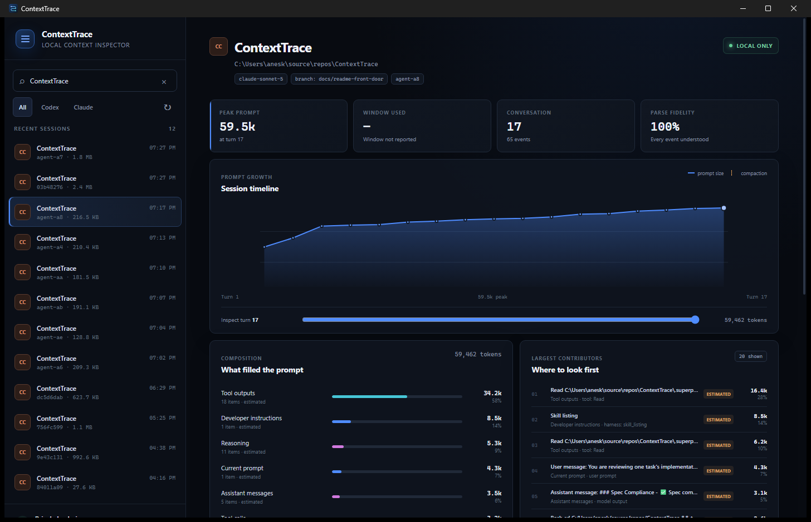

# ContextTrace

**DevTools for AI coding-agent context.**

ContextTrace is a local-first tool for inspecting what an AI coding agent
actually had in its context window, turn by turn — what was in it, where
each piece came from, how large it was, and how it evolved during the
session.

[](https://github.com/aneskurtovic/ContextTrace/actions/workflows/ci.yml)
[](LICENSE)

> **Status: 0.1 is not released.** The CLI is complete, and the desktop app
> runs the same discovery-to-diagnosis workflow through a native Windows UI.
> On 2026-08-01, `ct doctor --dir` parsed **816 local sessions** (717 Claude
> Code, 99 Codex) and recognised all **148,970 events** in 5.88 seconds. See
> [MVP status](docs/MVP-STATUS.md) for the evidence, gates and distance to a
> public release.



*The desktop app's overview panel: prompt growth over the session, what
filled the context window, and the largest contributors for the selected
turn.*

## What it is

It is not a chat-history viewer. The workflow it exists for is:

> *Why did the agent do that?* → inspect the turn → see the context → trace
> each item to its source → find the 38k-token garbage tool result →
> understand the behaviour.

Supported agents: **OpenAI Codex CLI** and **Anthropic Claude Code**.

## Features

What runs today:

| Feature | What it answers | Surface |
|---|---|---|
| Context composition | What filled a turn's context window, by category and confidence | CLI + desktop |
| Largest contributors | Which items are biggest, ranked and named by what they acted on | CLI + desktop |
| Item lifecycle tracing | When an item entered context, and when — or why — it left | CLI + desktop |
| Codex compaction diffs | Exactly what a compaction dropped, kept or replaced | CLI |
| Turn and session comparison | What changed between two turns, with measurement skew bounded | CLI |
| Growth chart | The whole session's prompt size over time, purely from observed data | CLI + desktop |
| Exact duplicate detection | Identical content repeated in a turn, and its token cost | CLI + desktop |
| Low-information scoring | Large, highly-compressible blocks ranked by likely waste | CLI + desktop |
| Secret scanning and redacted export | Where credential-shaped strings appear, without ever printing them | CLI |
| Format-drift sweep | Whether this build recognises every event type in a local corpus | CLI |
| NDJSON export | The whole session as typed records, cross-checked against the totals | CLI |
| Desktop app | The same measurements in a native Windows browsing and inspection UI | Desktop |

## Install

Windows x64 is the supported surface. There is no public download yet, so
the working path is a local build from source; it produces the same two
artifacts the release workflow packages.

### Prerequisites

- **Rust 1.88+.** `rust-toolchain.toml` selects the channel and adds
  `rustfmt` and `clippy`. On Windows the MSVC host toolchain — Visual
  Studio's "Desktop development with C++" workload — is required, because
  without it nothing links.
- **Node.js 22**, for the desktop app only. Node 18 runs `npm ci`
  successfully and then silently omits an optional native binding, so the
  failure surfaces much later as `Cannot find native binding`; see CT-061 in
  [BACKLOG.md](BACKLOG.md).

### The `ct` CLI

```powershell
cargo build --release -p ct-cli
```

`target\release\ct.exe` is portable: copy it anywhere on `PATH` and it needs
no installer, configuration or arguments to find your sessions.

```powershell
.\target\release\ct.exe roots            # which local directories it reads
.\target\release\ct.exe sessions --limit 10
```

### The desktop app

```powershell
cd crates\ct-ui
npm ci
npm run tauri build
```

Budget time for the first run: a cold release build of the workspace plus
the native webview stack took **39 minutes** on a recent laptop, most of it
silent. The bundling step also downloads its own NSIS toolchain from GitHub
the first time, so that step needs network access even though nothing it
builds does.

That writes an installer to
`target\release\bundle\nsis\ContextTrace_<version>_x64-setup.exe`. Running
it installs ContextTrace for the current user under `%LOCALAPPDATA%`, so it
never asks for administrator rights. Upgrade by running a newer installer
over the old one; remove it through Windows "Installed apps". The build is
unsigned, so expect a SmartScreen warning on first launch.

To run the app without installing it, use `npm run tauri dev` instead —
that is the native app against the real read-only local adapters.

### From a release candidate

Each `v<version>` tag produces a **draft** GitHub release, not yet public,
containing `ContextTrace-<version>-windows-x64-setup.exe` (the per-user
desktop installer), `ContextTrace-<version>-windows-x64-cli.zip` (the
companion `ct.exe` and license), and `SHA256SUMS.txt` (SHA-256 hashes for
both).

Before running a candidate, compare its hash with `SHA256SUMS.txt`:

```powershell
Get-FileHash .\ContextTrace-<version>-windows-x64-setup.exe -Algorithm SHA256
Get-FileHash .\ContextTrace-<version>-windows-x64-cli.zip -Algorithm SHA256
```

The desktop installer targets the current user and does not require
administrator access. To upgrade, run the newer installer over the existing
version; ContextTrace does not own or modify the Codex/Claude session
directories it reads. The CLI ZIP is portable: extract it and run
`.\ct.exe --help`.

Until a release candidate has a verified Windows signature, expect
SmartScreen to warn about the unsigned installer. See
[MVP status](docs/MVP-STATUS.md) for the current evidence ceiling and
[the release procedure](docs/RELEASING.md) for operator checks.

## Quickstart

Real output from this machine on 2026-08-01. Your own `sessions`/`context`
output will show your own local sessions instead.

```
> ct roots
ContextTrace reads these local directories (read-only):

  claude-code
    C:\Users\anesk\.claude\projects
  codex
    C:\Users\anesk\.codex\sessions

Nothing is written to them, and nothing leaves this machine.

> ct sessions --limit 10
ID          AGENT         LAST ACTIVITY            SIZE  PROJECT
agent-a6    claude-code   2026-08-01 19:43       1.0 MB  C:\Users\anesk\source\repos\ContextTrace
03b48276    claude-code   2026-08-01 19:43       3.2 MB  C:\Users\anesk\source\repos\ContextTrace
agent-ae    claude-code   2026-08-01 19:42     405.0 KB  C:\Users\anesk\source\repos\ContextTrace
... 7 more of the 10 shown, same columns ...

10 session(s). Inspect one with: ct inspect <id>

> ct context 03b48276
Context at turn 101 - 216,303 [observed]
Model      claude-opus-5
Estimator  heuristic:chars/2.4

  Tool outputs              173,749   80.3%  ████████████████····  [estimated]
  Tool calls                 21,419    9.9%  ██··················  [estimated]
  Reasoning                   7,326    3.4%  █···················  [estimated]
  ... 8 more categories; exact-duplicate and low-information sections
      also print by default and are omitted here for length ...

  Ratio      2.40 characters per token, measured from this session's own
             usage across 76 turn pairs (spread 2.9x).
  Unlogged   ~22,754 tokens the agent never wrote down -- its system prompt
             and tool JSON schemas. Measured, not assumed.
  The per-turn ratios varied widely, so this session mixes content that
  tokenizes very differently. The ratio is a middle value, not a constant.

  Calibration: estimates scaled by 0.34 to meet the observed total of 216,303.
  The estimator ran 192% high, so the scaled figures consumed the whole
  budget and no residual remains. That does NOT mean there is no hidden
  context -- the system prompt and tool schemas are still in the total, and their
  share has been absorbed into the categories above. Treat the breakdown
  as proportions, not as an inventory.

367 context items. Largest contributors: ct largest <id> --turn 101
```

The `Ratio` and `Unlogged` lines are the tool's central claim — that the
gap between what an agent logs and what it reports is measured, not
assumed. See [methodology](docs/methodology.md#the-ratio-is-measured-not-assumed)
for how the ratio is derived from a session's own turn-to-turn deltas.

## Commands

`ct context` and `ct largest` accept the same shared filter flags — a
reference summary below, not captured program output:

```
filters: --source <kind[:text]>  --category <name>
         --confidence <level>    --min-tokens <n>
```

| Command | What it answers |
|---|---|
| `ct roots` | Which local directories are read |
| `ct sessions` | Which sessions exist, filtered by agent, project, date or count |
| `ct inspect <id>` | The raw session structure and events, for debugging |
| `ct compactions <id>` | [What a Codex compaction dropped, kept or replaced](docs/guide.md#exact-codex-compaction-diffs-without-printing-prompt-content) |
| `ct context <id>` | What filled a turn's context window, by category and confidence |
| `ct largest <id>` | [The biggest contributors to a turn, narrowed by provenance or size](docs/guide.md#filtering-without-lying-about-the-whole) |
| `ct trace <id>` | [When an item entered context, and when — or why — it left](docs/guide.md#one-items-lifecycle-and-the-difference-between-gone-and-evicted) |
| `ct residual <id>` | The context the agent never wrote down, turn by turn |
| `ct diff` | [What changed between two turns or two sessions](docs/guide.md#comparing-two-turns-without-comparing-two-rulers) |
| `ct growth <id>` | [The whole session's prompt size over time](docs/guide.md#the-whole-session-at-once-using-only-what-the-agent-reported) |
| `ct doctor` | [Whether this build recognises every event type in a local corpus](docs/guide.md#catching-an-agent-that-changed-its-format) |
| `ct export <id>` | [The whole session as NDJSON, optionally redacted](docs/guide.md#getting-the-numbers-out) |
| `ct secrets <id>` | [Where credential-shaped strings appear, without ever printing them](docs/guide.md#finding-credentials-without-disclosing-them-again) |

Run `ct <command> --help` for the full option surface.

## Roadmap

Next up: a desktop compaction autopsy — the exact Codex compaction diff,
surfaced in the desktop app (CT-047); turn comparison in the desktop app
(CT-048); an installable 0.1.0 — clean-machine install/upgrade validation
and a release-candidate soak (CT-043).

Deliberately deferred: a persistent SQLite index, until measured
performance requires one; crates.io publication; Windows code signing,
until the production-release decision.

No dates, no promises. [BACKLOG.md](BACKLOG.md) is the authoritative list.

## How to read the numbers

Percentages in `ct context` and `ct largest` are shares of an **observed**
total — the agent's own reported prompt size — so they are trustworthy on
their own. Individual Claude Code item sizes are **calibrated estimates**:
Anthropic ships no local tokenizer, so each session's characters-per-token
ratio is fitted from its own turn-to-turn deltas, and `ct context` prints
both the derived ratio and the scale factor it applied. Codex items can be
measured exactly with `--exact`, but even that covers only the items whose
content is plain text — encrypted, structured or image content keeps its
estimate, and the header says how many did.

Two limitations are stated by the tool rather than hidden by it:

- On sessions where reconstruction over-counts logged content relative to
  the reported prompt, the unlogged remainder cannot be separated from the
  over-count — `ct context` says so instead of printing a zero residual
  that would imply a complete inventory.
- `ct doctor` reports turns whose figures came from several API calls
  folded into one record, and reasoning events whose text the log redacted
  — both cases where a number is weaker than its presentation suggests.

**The main known gap** is that over-counting: on roughly one Claude Code
session in seven, the reconstruction accounts for more content than the
prompt held, and the cause is not established. ContextTrace detects the
discrepancy and reports it rather than modelling a behaviour it cannot
observe.

See [methodology](docs/methodology.md) for how the ratio is derived, what
`--exact` does and does not cover, and the evidence behind each claim above.

## Privacy

**Local-first.** Session data contains source code, prompts, terminal
output and potentially secrets. ContextTrace has no upload, telemetry or
cloud code. The desktop capability set is core-only and its
content-security policy permits only local Tauri IPC; session data stays on
the machine.

**Read-only.** Agent directories are inputs. ContextTrace never writes to them.

## Documentation

| Doc | What it answers |
|---|---|
| [Guide](docs/guide.md) | Worked examples, one per command, with real output |
| [Formats](docs/formats.md) | What Codex CLI and Claude Code actually write to disk |
| [Methodology](docs/methodology.md) | How two agents' logs become comparable numbers, and where the tool refuses to answer |
| [Architecture](docs/architecture.md) | Crate layout, the invariants the type system enforces, fixtures and testing |
| [MVP status](docs/MVP-STATUS.md) | What's implemented, what's gated, and the release plan |
| [Release procedure](docs/RELEASING.md) | How Windows release candidates are built, checked and optionally signed |

## Contributing

[BACKLOG.md](BACKLOG.md) is the authoritative work list; [IDEAS.md](IDEAS.md)
is an unscheduled pool — nothing in it is planned until it is pulled into
BACKLOG.md with a `CT-nnn` id.

These are the gates CI enforces:

```bash
cargo fmt --all -- --check
cargo clippy --workspace --all-targets -- -D warnings
cargo test --workspace --all-targets
cargo build --workspace --release

cd crates/ct-ui
npm ci
npm test
npm run build
npm run tauri build -- --no-bundle
```

`npm run dev` by itself opens a browser preview backed by synthetic sessions;
`npm run tauri dev` runs the native app against the real read-only local
adapters.

Node 18 runs `npm ci` successfully and then silently omits an optional
native binding, so the failure surfaces later as `Cannot find native
binding` — use Node 22. The minimum Rust version is **1.88**, raised from
1.85 once the Tauri dependency graph made the old claim false; CI checks
1.88 explicitly.

## License

[MIT](LICENSE)
