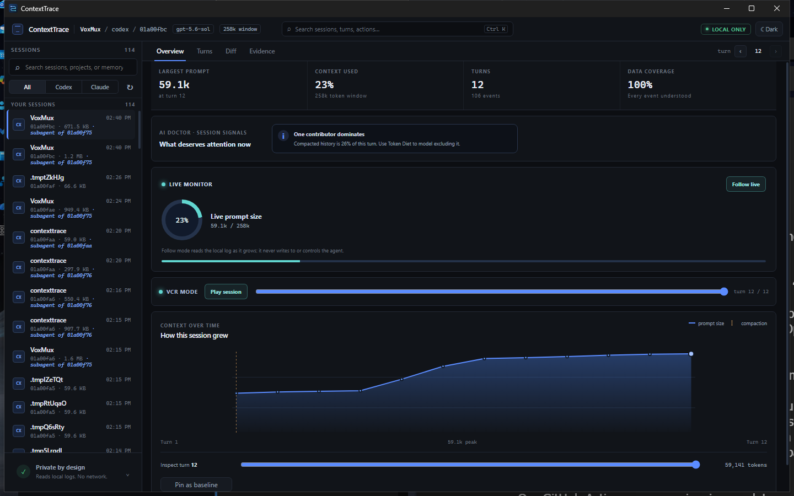
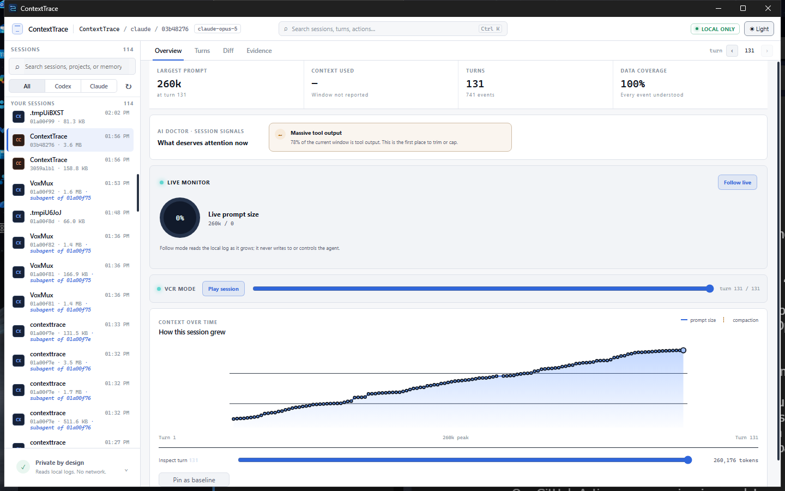

# ContextTrace

**DevTools for AI coding-agent context.**

ContextTrace is a local-first tool for inspecting what an AI coding agent
actually had in its context window, turn by turn — what was in it, where
each piece came from, how large it was, and how it evolved during the
session.

[](LICENSE)

> **Status: source and the Windows 0.1.2 binary release are public.**
> The CLI and Windows desktop app implement the discovery-to-diagnosis
> workflow. Compatibility is limited to the persisted JSONL formats and
> producer versions covered by committed fixtures. See [MVP status](docs/MVP-STATUS.md)
> for current verification and release gates.





*The redesigned desktop app provides the same local-first measurements in
dark and light themes, with overview, turns, diff and evidence views.*

## What it is

It is not a chat-history viewer. The workflow it exists for is:

> *Why did the agent do that?* → inspect the turn → see the context → trace
> each item to its source → find the 38k-token garbage tool result →
> understand the behaviour.

Supported agents: **OpenAI Codex CLI** and **Anthropic Claude Code**.
The supported input surface is their persisted local session JSONL; see the
[format compatibility policy](docs/FORMAT-COMPATIBILITY.md) for versioned
fixtures, limits and the update process.

## Features

What runs today:

| Feature | What it answers | Surface |
|---|---|---|
| Corpus summary | Where a month of sessions went, and what the totals could not measure | CLI + desktop |
| Session transcript | What was actually said, with injected content and tool results in place | CLI + desktop |
| Named sessions | Which session is which, from the log's own title or first prompt | CLI + desktop |
| Context composition | What filled a turn's context window, by category and confidence | CLI + desktop |
| Largest contributors | Which items are biggest, ranked and named by what they acted on | CLI + desktop |
| Item lifecycle tracing | When an item entered context, and when — or why — it left | CLI + desktop |
| Codex compaction diffs | Exactly what a compaction dropped, kept or replaced | CLI + desktop |
| Turn and session comparison | What changed between two turns, with measurement skew bounded | CLI + desktop |
| Unlogged context | The prompt an agent never wrote down, and when its harness changed | CLI + desktop |
| Growth chart | The whole session's prompt size over time, purely from observed data | CLI + desktop |
| Exact duplicate detection | Identical content repeated in a turn, and its token cost | CLI + desktop |
| Low-information scoring | Large, highly-compressible blocks ranked by likely waste | CLI + desktop |
| Secret scanning and redacted export | Where credential-shaped strings appear, without ever printing them | CLI + desktop |
| Format-drift sweep | Whether this build recognises every event type across a local corpus | CLI |
| Parse fidelity | How much of one session this build understood, and what it did not | CLI + desktop |
| NDJSON export | The whole session as typed records, cross-checked against the totals | CLI + desktop |
| Session archive | A copy that outlives the log, and whether it still matches its source | CLI + desktop |
| Desktop app | The same measurements in a native Windows browsing and inspection UI | Desktop |
| Notifications | Which sessions crossed a threshold while you were away, and whether the toast actually arrived | Desktop |

## Install

Windows x64 is the supported surface. After a stable release is published,
install the latest desktop version for the current user from PowerShell:

```powershell
irm https://raw.githubusercontent.com/aneskurtovic/ContextTrace/main/scripts/install.ps1 | iex
```

The installer downloads the latest stable release, checks the installer
against its published SHA-256 checksum and starts the per-user setup. No
administrator rights are required. The release page also provides the
portable desktop and CLI downloads. Until the first stable binary release is
published, build from source using the steps below.

### Prerequisites

- **Rust 1.88+.** `rust-toolchain.toml` selects the channel and adds
  `rustfmt` and `clippy`. On Windows the MSVC host toolchain — Visual
  Studio's "Desktop development with C++" workload — is required, because
  without it nothing links.
- **Node.js 22**, for the desktop app only. Node 18 runs `npm ci`
  successfully and then silently omits an optional native binding, so the
  failure surfaces much later as `Cannot find native binding`.

### The `ct` CLI

```powershell
cargo build --release -p ct-cli
```

`target\release\ct.exe` is portable: copy it anywhere on `PATH` and it needs
no installer, configuration or arguments to find your sessions.

```powershell
.\target\release\ct.exe roots            # which local directories it reads
.\target\release\ct.exe sessions --limit 10
```

### The desktop app

```powershell
cd crates\ct-ui
npm ci
npm run tauri build
```

Budget extra time for the first run: a cold release build compiles the
workspace and native webview stack. The bundling step also downloads its own
NSIS toolchain from GitHub the first time, so that step needs network access.

That writes an installer to
`target\release\bundle\nsis\ContextTrace_<version>_x64-setup.exe`. Running
it installs ContextTrace for the current user under `%LOCALAPPDATA%`, so it
never asks for administrator rights. Upgrade by running a newer installer
over the old one; remove it through Windows "Installed apps". The build is
unsigned, so expect a SmartScreen warning on first launch.

To run the app without installing it, use `npm run tauri dev` instead —
that is the native app against the real read-only local adapters.

### From a release candidate

Each `v<version>` tag produces staged assets for a release. Once published,
the stable release contains `ContextTrace-<version>-windows-x64-setup.exe` (the per-user
desktop installer), `ContextTrace-<version>-windows-x64-portable.zip` (the
desktop executable for extract-and-run use), `ContextTrace-<version>-windows-x64-cli.zip`
(the companion `ct.exe` and license), and `SHA256SUMS.txt`.

Before running a candidate, compare its hash with `SHA256SUMS.txt`:

```powershell
Get-FileHash .\ContextTrace-<version>-windows-x64-setup.exe -Algorithm SHA256
Get-FileHash .\ContextTrace-<version>-windows-x64-portable.zip -Algorithm SHA256
Get-FileHash .\ContextTrace-<version>-windows-x64-cli.zip -Algorithm SHA256
```

The desktop installer targets the current user and does not require
administrator access. To upgrade, run the newer installer over the existing
version; ContextTrace does not own or modify the Codex/Claude session
directories it reads. The desktop portable ZIP is for users who do not want
an installer: extract it and run the included `context-trace.exe`. It still
requires Microsoft Edge WebView2 Runtime. The CLI ZIP is also portable:
extract it and run `.\ct.exe --help`.

**Uninstalling does not remove archived sessions.** `ct archive` writes to
`%LOCALAPPDATA%\ContextTrace-archive`, deliberately a sibling of the app's
install directory rather than a folder inside it: for sessions whose logs are
already gone, those copies are the only remaining evidence, and an uninstaller
must not be able to take them with it. The consequence is that they outlive the
app, so delete that directory yourself if you want them gone — and note it holds
session content, including credentials if anything was archived with `--raw`.
Nothing else survives removal.

Until a release candidate has a verified Windows signature, expect
SmartScreen to warn about the unsigned installer. See
[MVP status](docs/MVP-STATUS.md) for the current evidence ceiling and
[the release procedure](docs/RELEASING.md) for operator checks.

## Quickstart

The following is synthetic illustrative output. The IDs, paths, dates, model
label and measurements are placeholders; they are not copied from a user's
session corpus. Your output contains your own local session metadata.

```
> ct roots
ContextTrace reads these local directories (read-only):

  claude-code
  C:\Users\you\.claude\projects
  codex
  C:\Users\you\.codex\sessions

Nothing is written to them.

It writes to one ContextTrace-owned directory. Archive/export copies are
explicit; the desktop also persists notification state and the remembered
format sweep there:

  C:\Users\you\AppData\Local\ContextTrace-archive

Nothing leaves this machine either way.

> ct sessions --limit 10
ID          AGENT         LAST ACTIVITY            SIZE  PROJECT
claude-demo claude-code   2026-01-01 12:00      12.0 KB  C:\work\example-project
codex-demo  codex         2026-01-01 11:30       8.0 KB  C:\work\example-project

2 session(s). Inspect one with: ct inspect <id>

> ct context claude-demo
Context at turn 3 - 12,000 [observed]
Model      example-model
Estimator  heuristic:chars/2.4

  Tool outputs                5,200  43.3%  █████████···········  [estimated]
  Conversation                3,100  25.8%  █████···············  [estimated]
  Tool calls                  1,200  10.0%  ██··················  [estimated]

  Ratio      2.40 characters per token, fitted from this session's turns.
  Unlogged   ~2,500 tokens not attributed to reconstructed items.

Illustrative only. Actual output labels estimate confidence and measurement
limits for the selected session.
```

The `Ratio` and `Unlogged` lines are the tool's central claim — that the
gap between what an agent logs and what it reports is measured, not
assumed. See [methodology](docs/methodology.md#per-session-calibration)
for how the ratio is derived from a session's own turn-to-turn deltas.

## Commands

`ct context` and `ct largest` accept the same shared filter flags — a
reference summary below, not captured program output:

```
filters: --source <kind[:text]>  --category <name>
         --confidence <level>    --min-tokens <n>
```

| Command | What it answers |
|---|---|
| `ct roots` | Which local directories are read, and the one that is written |
| `ct archive <id>` | Keep a copy of a session so it outlives its log |
| `ct sessions` | Which sessions exist, filtered by agent, project, date or count |
| `ct families` | Group recorded root and subagent sessions into families |
| `ct stats` | Summarise every local session at once |
| `ct cost <id>` | Estimate category costs, or compare a model/token-cap what-if |
| `ct ghost <id> <from> <to>` | Show context items gained, retained and removed between turns |
| `ct fidelity <id>` | Show parse fidelity per turn and unassigned events |
| `ct instructions <id>` | Show observed instruction signatures and drift |
| `ct instruction-files <id>` | Compare recorded instruction bodies with current files on disk |
| `ct mcp` | Serve read-only session queries over local stdio JSON-RPC |
| `ct inspect <id>` | The raw session structure and events, for debugging |
| `ct transcript <id>` | Read a session back as the conversation it was |
| `ct compactions <id>` | [What a Codex compaction dropped, kept or replaced](docs/guide.md#exact-codex-compaction-diffs-without-printing-prompt-content) |
| `ct context <id>` | What filled a turn's context window, by category and confidence |
| `ct largest <id>` | [The biggest contributors to a turn, narrowed by provenance or size](docs/guide.md#filtering-without-lying-about-the-whole) |
| `ct trace <id>` | [When an item entered context, and when — or why — it left](docs/guide.md#one-items-lifecycle-and-the-difference-between-gone-and-evicted) |
| `ct residual <id>` | The context the agent never wrote down, turn by turn |
| `ct diff` | [What changed between two turns or two sessions](docs/guide.md#comparing-two-turns-without-comparing-two-rulers) |
| `ct growth <id>` | [The whole session's prompt size over time](docs/guide.md#the-whole-session-at-once-using-only-what-the-agent-reported) |
| `ct doctor` | [Whether this build recognises every event type in a local corpus](docs/guide.md#catching-an-agent-that-changed-its-format) |
| `ct export <id>` | [The whole session as NDJSON, optionally redacted](docs/guide.md#getting-the-numbers-out) |
| `ct secrets <id>` | [Where credential-shaped strings appear, without ever printing them](docs/guide.md#finding-credentials-without-disclosing-them-again) |

Run `ct <command> --help` for the full option surface.

## Roadmap

The updater-enabled 0.1.2 Windows release is available. See the [install
instructions](#install) and [release downloads](https://github.com/aneskurtovic/ContextTrace/releases/latest).

Configurable local pricing/forecasting, instruction-file comparisons and
temporal ghost views are available in the CLI, MCP surface and desktop app.

Deliberately deferred: a persistent SQLite index, until measured
performance requires one; crates.io publication; an Authenticode signing
certificate until the production-release decision.

No dates or promises. See the [public roadmap](docs/ROADMAP.md).

### Local pricing overrides

`ct cost <id> --pricing pricing.json --forecast-turns 20` reads a local JSON
override without changing the bundled table. Rates are integer microdollars per
million tokens so the file remains exact and reviewable:

```json
{
  "version": "contract-2026-08",
  "source": "local provider agreement",
  "rates": [
    {
      "model_prefix": "claude-sonnet-4",
      "rate": {
        "input_per_million": 3000000,
        "cache_read_per_million": 300000,
        "cache_write_per_million": 3750000,
        "output_per_million": 15000000
      }
    }
  ]
}
```

The forecast uses the average priced turn as an estimate for the explicit
additional-turn horizon; future model choice, cache state and agent behaviour
are not observed.

## How to read the numbers

Percentages in `ct context` and `ct largest` are shares of an **observed**
total — the agent's own reported prompt size — so they are trustworthy on
their own. Individual Claude Code item sizes are **calibrated estimates**:
Anthropic ships no local tokenizer, so each session's characters-per-token
ratio is fitted from its own turn-to-turn deltas, and `ct context` prints
both the derived ratio and the scale factor it applied. Codex items can be
measured exactly with `--exact`, but even that covers only the items whose
content is plain text — encrypted, structured or image content keeps its
estimate, and the header says how many did.

Two limitations are stated by the tool rather than hidden by it:

- On sessions where reconstruction over-counts logged content relative to
  the reported prompt, the unlogged remainder cannot be separated from the
  over-count — `ct context` says so instead of printing a zero residual
  that would imply a complete inventory.
- `ct doctor` reports turns whose figures came from several API calls
  folded into one record, and reasoning events whose text the log redacted
  — both cases where a number is weaker than its presentation suggests.

**The main known gap** is that reconstruction can account for more content
than the reported prompt held, and the cause may not be recorded. ContextTrace
detects the discrepancy and reports it rather than modelling a behaviour it
cannot observe.

See [methodology](docs/methodology.md) for how the ratio is derived, what
`--exact` does and does not cover, and the evidence behind each claim above.

## Privacy

**Local-first.** Session data contains source code, prompts, terminal
output and potentially secrets. ContextTrace has no upload, telemetry or
cloud code. The desktop capability set is core-only and its
content-security policy permits only local Tauri IPC; session data stays on
the machine.

**Read-only.** Agent directories are inputs. ContextTrace never writes to them.

**One ContextTrace-owned directory.** `ct archive <id>` keeps a copy of a session so
it outlives its log — a log that is rotated, pruned, or lost with a wiped home
directory takes its evidence with it, and nothing can reconstruct a file that is
gone. Copies go to a ContextTrace-owned directory, never back to an agent's, and
`ct roots` prints its exact path whether or not anything has been archived yet.
Nothing is archived until you ask for it.

The desktop app writes to that same directory and no other: its Archive panel
does what `ct archive` does, its Export panel writes NDJSON to an `exports`
subdirectory, and notification history/preferences plus the remembered corpus
sweep live in their own subdirectories. These automatic state writes contain
ContextTrace's local summaries and settings, not a copy of the agent roots.

An archive concentrates by construction what was previously scattered: one place
holding every prompt, tool output and credential a machine has produced is a
materially better target than the logs it came from. So credential-shaped values
are replaced on the way in by default, `--raw` is the explicit opt-out, and which
of the two was used is recorded against each session. Most sessions contain no
credentials at all, and for those the copy is byte-identical to the log.

The desktop's export redacts by default too, which `ct export` does not. The
CLI writes to stdout — you choose the destination in the same breath as the
command, and often it is a pipe that never becomes a file. The desktop writes a
durable file into that shared directory, so the argument that made the archive
redact by default applies to it unchanged.

## Documentation

| Doc | What it answers |
|---|---|
| [Guide](docs/guide.md) | Common workflows with fictional example IDs and values |
| [Formats](docs/formats.md) | What Codex CLI and Claude Code actually write to disk |
| [Compatibility](docs/FORMAT-COMPATIBILITY.md) | Versioned format evidence and the fixture update process |
| [Methodology](docs/methodology.md) | How two agents' logs become comparable numbers, and where the tool refuses to answer |
| [Architecture](docs/architecture.md) | Crate layout, the invariants the type system enforces, fixtures and testing |
| [MVP status](docs/MVP-STATUS.md) | What's implemented, what's gated, and the release plan |
| [Release procedure](docs/RELEASING.md) | How Windows release candidates are built, checked and optionally signed |
| [Continuous integration](docs/CI.md) | What runs on Linux, what needs real Windows, and what a green pipeline still does not prove |
| [Updater](docs/UPDATER.md) | Desktop update behavior and release-feed requirements |
| [Documentation index](docs/README.md) | Public documentation map |
| [Notifications](docs/notifications.md) | The twelve rules, how delivery is decided, and why a delivered toast is not assumed |

## Contributing

The [roadmap](docs/ROADMAP.md) lists areas of interest, not commitments.
Project-specific contributor guidance is in [CLAUDE.md](CLAUDE.md).

These are the gates [CI](docs/CI.md) enforces. Most of them run on Linux, and
need no Windows to reproduce:

```bash
cargo fmt --all -- --check
cargo clippy --workspace --exclude ct-ui --all-targets --locked -- -D warnings
cargo test --workspace --exclude ct-ui --all-targets --locked
cargo +1.88.0 check --workspace --exclude ct-ui --all-targets --locked
cd crates/ct-ui
npm ci
npm test
npm run build
```

The rest run only on Windows, because `ct-ui` links a real WebView2
application and the smokes assert on Windows path handling and on the bytes
the archive writes:

```powershell
cargo clippy --workspace --all-targets --locked -- -D warnings
cargo test --workspace --all-targets --locked
cargo build --release --locked -p ct-cli

Push-Location crates/ct-ui
npm ci
.\node_modules\.bin\tauri.cmd build --no-bundle --ci -- --locked
Pop-Location

powershell -NoProfile -ExecutionPolicy Bypass -File scripts/ci/smoke-cli.ps1
powershell -NoProfile -ExecutionPolicy Bypass -File scripts/ci/smoke-secrets.ps1
powershell -NoProfile -ExecutionPolicy Bypass -File scripts/ci/smoke-archive.ps1
```

The smokes arrange their own fixtures under isolated `CODEX_HOME`,
`CLAUDE_CONFIG_DIR` and `CONTEXTTRACE_ARCHIVE` roots, so running them cannot
read or write your real sessions and archive.

`npm run dev` by itself opens a browser preview backed by synthetic sessions;
`npm run tauri dev` runs the native app against the real read-only local
adapters.

Node 18 runs `npm ci` successfully and then silently omits an optional
native binding, so the failure surfaces later as `Cannot find native
binding` — use Node 22. The minimum Rust version is **1.88**, raised from
1.85 once the Tauri dependency graph made the old claim false; CI checks
1.88 explicitly.

## License

[MIT](LICENSE)

